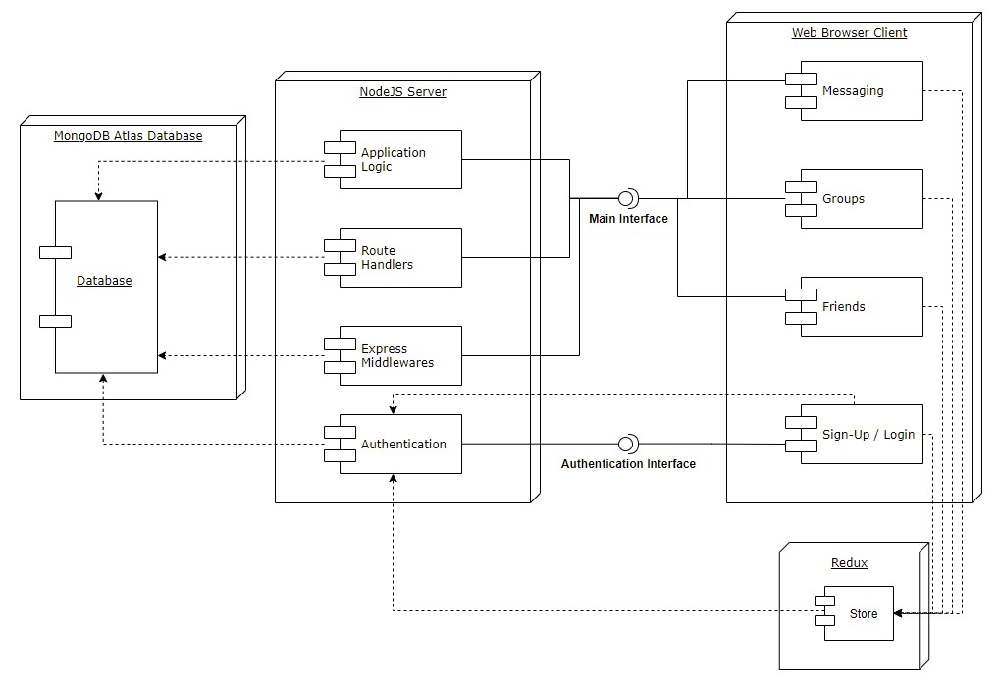

# Study_Connect
Lucas Radovan
Mansur Ischanov
Raphael Pham
Keith Vega
Caroline Padilla

System Architecture:

Style Guide:
https://google.github.io/styleguide/jsguide.html

Project CI Web Page:
https://travis-ci.com/github/Raphael-Pham/study_connect

Setup:
1. Git clone the repository into a local directory.
2. Install Node.js for the appropriate operating system: https://nodejs.org/en/download/.
3. Run "cd backend" in a terminal to navigate to the backend folder of the repository.
4. Run "npm run start" to initialize the server and establish a connection to the MongoDB database.
5. Open a separate terminal.
6. Run "cd frontend" to navigate to the frontend folder of the repository.
7. Run "npm i react-scripts @material-ui/lab" to install necessary packages.
8. Create an account on the React webpage and connect with others!